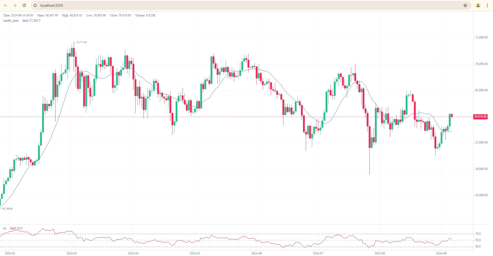

# GoQuant

GoQuant is a powerful Go framework designed for financial data analysis and visualizations, with no boundaries!

## Features

- MQL-like Syntax: Write strategies using familiar PineScript/MQL expressions, completely supporting series nature!
```Golang
// Example: (close[0] + rsi(sma(close, 20), 14)[1]) [2]
// Adds the current close price to the RSI of the previous bar with SMA as the source, 
// then retrieves the result for 2 bars ago

myGreatSerie := close.Add(ta.RSI(ta.SMA(close, 20), 14).B(1))
fmt.Println(myGreatSerie.G(2)) // Retrieve result for 2 bars ago

// Alternatively, without chaining methods:

myGreatSerie := GQ.NewWrapper(func() float64 {
	sma := ta.SMA(close, 20)
	return close.G(0) + ta.RSI(sma, 14).G(1)
})

// Retrieve result for 2 bars ago
fmt.Println(myGreatSerie.G(2))
```
- Excellent caching system; just determine when to cache!

```Golang
rsi := ta.RSI(close, 14).Cache()
fmt.Println(rsi.G(0))
fmt.Println(rsi.G(1)) // Retrieved from cache! as already computed in previous cycle.
```

- Add data when you like, everything will be synced!
```Golang
GQ.AddBars(data)
GQ.Logic(myLogic)

GQ.AddBars(restData)
GQ.Logic(myLogic) // Automatically runs only for the newly added data

...
```

- Professional visualization with ease! Plot and draw across different panels simultaneously.
```Golang
plot(rsi, &PlotConfig{Color: "blue", Width: 2, Location: "rsi"})

// rsi 30, 70 and middle lines
hline(30, &LineConfig{Color: "#787B80", Width: 1, Dashed: 5, Location: "rsi"})
hline(50, &LineConfig{Color: "#787B80", Width: .5, Dashed: 5, Location: "rsi"})
hline(70, &LineConfig{Color: "#787B80", Width: 1, Dashed: 5, Location: "rsi"})
```
Next view result at http://localhost:3000

The chart is powered by [KLineChart](https://github.com/klinecharts/KLineChart), a zero-dependency, highly customizable charting library with built-in tools like Fibonacci, patterns, and annotations.

- Batteries included: built-in famous indicators as well as complex functions from `BarsSince`, `ValueWhen` to `PivotHigh`, `Cross`, `CrossOver` etc. It takes less than 3 minutes to write your complex functions!

- Zero-dependency and extensible: Add anything you need—it's a pure Golang framework that you can extend and connect to other systems freely

- Support for bar gaps: Handle missing data with `math.NaN()`—series and plots will adjust accordingly.

- Lazy evaluation: All operations such as Add and Mul are evaluated only when required, allowing for optimized computation, particularly with large datasets.

- Flexible data sources: Connect to stock, crypto, or any OHLC data—real-time or historical.

- Concurrency support: Utilize Go's goroutines for parallel strategy execution on different timeframes or for non-dependent calculations.

- Community-driven: We're excited to extend the framework based on your feedback—share your ideas with us!

## Installation

```bash
  go get github.com/Go-Quant/goquant
```

## Usage Example

```Golang
package main

import (
	"fmt"
	gq "github.com/Go-Quant/goquant/core"
	"github.com/Go-Quant/goquant/serie"
)

var GQ *gq.GoQuant

func main() {
	port := 3000
	data, err := serie.ProcessBarsFromPath("./sample-data.json")
	if err != nil {
		panic(err)
	}

	GQ = gq.New()
	GQ.AddBars(data)
	GQ.Logic(myLogic)

	fmt.Printf("Server running at http://localhost:%d\n", port)
	panic(GQ.Server(port))
}

// shortcuts
type PlotConfig = gq.PlotConfig
type LineConfig = gq.LineConfig
type Point = gq.Point

func myLogic(open, high, close, low, volume, _time serie.Serie, ta gq.TA, plot gq.PlotF, line gq.LineF, vline gq.VLineF, hline gq.HLineF) {

	rsi := ta.RSI(close, 14).Get() // or .G(0)
	sma := ta.SMA(close, 14).Get() // or .G(0)

	plot(sma, &PlotConfig{Location: "candle_pane"})
	plot(rsi, nil, "rsi")

	// rsi 30, 50 and 70 lines
	hline(30, &LineConfig{Color: "#787B80", Width: 1, Dashed: 5, Location: "rsi"})
	hline(50, &LineConfig{Color: "#787B80", Width: .5, Dashed: 5, Location: "rsi"})
	hline(70, &LineConfig{Color: "#787B80", Width: 1, Dashed: 5, Location: "rsi"})
}

```

## Demo

Result of above code will be like:


## API Reference

#### Get the loaded bars

```http
  GET /bars
```

#### Get the plots

```http
  GET /plots
```

#### Get all the lines; including all trend and straight lines

```http
  GET /lines
```

## Roadmap

- Add unit tests
- Implement more indicators
- Develop a backtesting system with support for Stop, StopLoss, Market, Limit, and trailing orders
- Add order execution system connected to exchanges/brokers via API
- Use KLineChart Pro, and extending the visual tools
- Add `compare` and `walk-forward` charting features
- Incorporate AI-based code generation and debugging with LLM

## Contributing

Contributions are always welcome!

See `contributing.md` for ways to get started.

## License

[CC BY-NC 4.0](https://creativecommons.org/licenses/by-nc/4.0/):
For commercial usage, please contact us.
